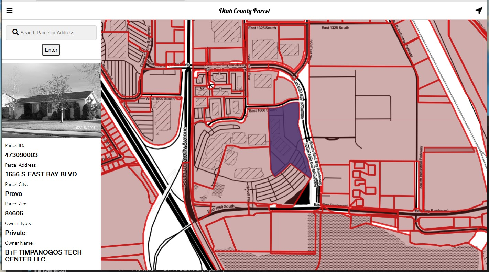

# Utah-parcels-opensource
Sample open source stack display utah county parcel data. The repo currently is only set up for development.
Need to add load balancers for tiles and convert flask to run for production.

The only things needed is docker-compose to be installed and python to populate the database docker will do the rest.

Once docker is installed:
``` bash
Docker-compose up
```

This should run everything and when its finished you will need to run python script in folder called python.

``` python

python set_up_db.py

```

this script downloads a zip file from google docs, unzips the data reprojects the data and finaly pushes the data
to a postgis instance running in docker.

The stack is python, postgis, trex

## web stack

The web server is currently python and flask I could do node or golang if I wanted.

Using basic html and js at the moment with mapbox gl being used for the map portion.



 
